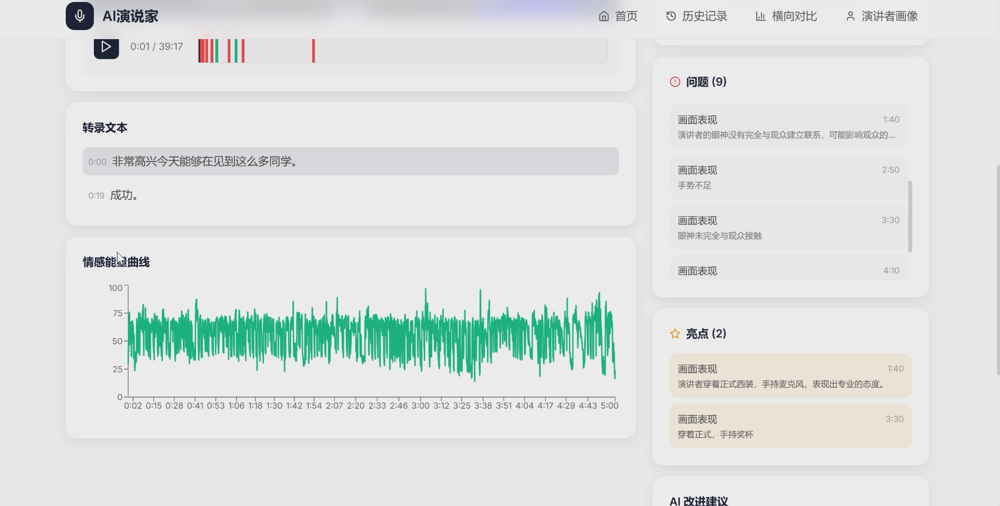
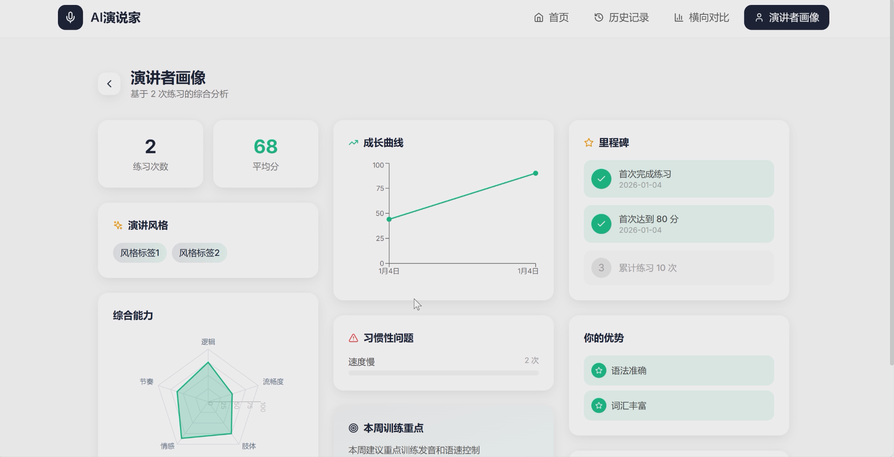

<div align="center">

# AI Presenter

**Multimodal presentation coaching with feedback linked to the exact moments that need attention.**

`React` · `TypeScript` · `FastAPI` · `SQLite` · `MediaPipe` · `WebSocket audio`

</div>

<table>
<tr>
<td width="50%"></td>
<td width="50%"></td>
</tr>
<tr>
<td colspan="2"></td>
</tr>
</table>

AI Presenter turns a rehearsal into an evidence-linked review. It combines speech recognition, acoustic analysis, browser-side visual signals and slide understanding, then aligns every issue to the presentation timeline.

## Highlights

- **Six integrated modes** — three guided practice modes and three upload-based analysis modes for decks, scripts and recorded talks.
- **Multimodal feedback** — speech, pacing, acoustic and visual signals are aligned by timestamp instead of reviewed in isolation.
- **Traceable review** — every detected issue links back to the corresponding line and moment in the recording.
- **Session comparison** — results are stored in SQLite for review, comparison and PDF export.

## How it works

```text
Browser                                     FastAPI backend

Microphone ── 16 kHz PCM / WebSocket ───► speech recognition
MediaPipe ── derived visual events ──────► multimodal alignment
Slides / script / video ─────────────────► content analysis
                                                    │
                                                    ▼
                                      five-dimension feedback
                                                    │
                                                    ▼
                                    review · compare · export
```

MediaPipe runs in the browser, so the backend receives derived visual events rather than raw webcam footage. Audio is streamed during practice, while uploaded videos follow the same review pipeline after extraction.

## Five-dimension feedback

| Dimension | Signals used |
| --- | --- |
| Fluency | Filler words, pauses and speaking speed |
| Pacing | Fast/slow segments and long-pause events |
| Delivery | Gaze, posture and head-position events, with key-frame review |
| Logic | Transcript issue patterns, including disfluency and long pauses |
| Emotion | Acoustic features extracted from the voice track |

The final review combines measured signals, model-assisted interpretation and rule-based calibration into one consistent session summary. In the committed example, a 19-slide rehearsal produces 24 timestamped issues, including a pace warning at `1:22`.

## Quick start

### Requirements

- Windows 10/11
- Python 3.11+
- Node.js 18+
- Zhipu GLM and Baidu real-time ASR credentials
- ffmpeg on `PATH`
- Poppler for PDF slide import
- Microsoft PowerPoint for the `.pptx` COM import path

```powershell
start.bat   # first run: install backend dependencies and create backend/.env
start.bat   # second run: install frontend dependencies and launch the app
```

The API starts at `http://127.0.0.1:8000` and the interface at `http://127.0.0.1:5173`. API credentials stay in `backend/.env`; no keys are committed.

## Project context

Designed and implemented independently as a full-stack presentation-coaching system. The project focuses on the engineering problem behind useful coaching: turning several asynchronous signals into feedback that a presenter can inspect and act on.

## License

Released under the [MIT License](LICENSE).
